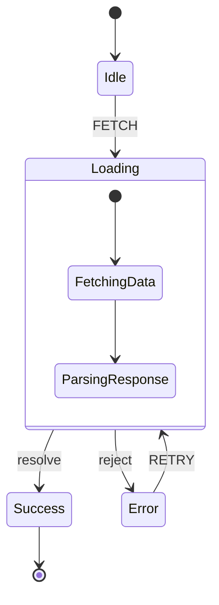

# Generate State Diagram

Create a visual state diagram from an XState machine definition or a natural language workflow description.

## Instructions

### 1. Identify the Source

- If the user has an XState machine definition, extract states and transitions from the code
- If the user describes a workflow in natural language, model it as states and transitions
- If the user points to a file, read it and find `createMachine` calls

### 2. Extract States and Transitions

For each state, identify:
- State name
- Whether it's initial, final, or intermediate
- Transitions: event → target state
- Guards (conditions)
- Actions
- Nested states (for hierarchical machines)
- Parallel regions

### 3. Generate Diagram

#### ASCII Format

```
┌─────────┐    EVENT     ┌─────────┐
│  state1  │ ──────────▶ │  state2  │
│(initial) │             │          │
└─────────┘             └────┬────┘
                              │ EVENT2
                              ▼
                         ┌─────────┐
                         │  state3  │
                         │ (final)  │
                         └─────────┘
```

Use these conventions:
- `(initial)` for the initial state
- `(final)` for final states
- `[guard]` for guarded transitions
- Arrow direction shows transition flow
- List events on arrows

#### Mermaid Format



### 4. Include Summary

After the diagram, add:
- Total states count
- Total transitions count
- List of events
- Any guards or conditions
- Notes about parallel regions or nested states

### 5. Suggest Improvements

If you notice issues:
- Unreachable states
- States with no exit transitions (unintentional dead ends)
- Missing error handling states
- Opportunities for hierarchy or parallelism
